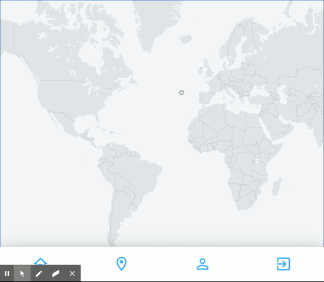

# travel-pins

A social media app that will inspire people to travel the world.

[Deployment](https://travel-pins.herokuapp.com/)

## Description

Do you love to travel? This app is for you. In this app, you create your own personalized account. You can view all of the countries in the world with a click. If you have traveled to a country, you can mark the country as "traveled." The country will highlight blue to show that you have traveled to the country.

You can upload your photos for each country as well! You simply click on the country you want to upload a photo to and then press the plus button to upload. This is an opportunity to keep a photo journal of your travels and share your pictures with others.

You can find other travelers as well on the app. You can search their username and follow them. Once you follow them, you can see photos about their travels on your newsfeed.

Lastly, you have your own profile account. You can see how many countries you have been to, how many followers you have, how many users follow you, and your photos.

## Table of Contents

- [Installation](#installation)
- [Usage](#usage)
- [Technologies](#technologies)
- [Credits](#credits)
- [License](#license)

## Installation

No installations necessary. Please clicked on the deployed link to access. [Deployment](https://travel-pins.herokuapp.com/)

## Usage

1. Create an account or login.

2. Find a country.

3. Mark a country as traveled.

4. Upload a photo.

5. Find a User to follow and unfollow.

6. View your news feed.

7. View Your Profile.

## Technologies

#### Frontend Dependencies

- mapbox-gl: ^1.12.0
- re-carousel: ^2.4.0
- react: ^17.0.1
- react-dom: ^17.0.1
- react-icons: ^3.11.0
- react-router-dom: ^5.2.0
- react-scripts: 4.0.0
- react-spring: ^8.0.27
- react-swipeable: ^6.0.0
- react-transition-group: ^4.4.1
- web-vitals: ^0.2.4

#### Backend Dependencies

- axios: ^0.18.0
- bcryptjs: ^2.4.3
- cloudinary: ^1.23.0
- express: ^4.16.3
- express-session: ^1.17.1
- if-env: ^1.0.4
- mysql2: ^2.2.5
- passport: ^0.4.1
- passport-local: ^1.0.0
- sequelize: ^6.3.5

## Credits

David Anusontarangkul

[Github](https://github.com/anusontarangkul)
[LinkedIn](https://www.linkedin.com/in/anusontarangkul/)

Jonathan Honda

[Github](https://github.com/hondahelix)
[LinkedIn](https://www.linkedin.com/in/jonathan-honda-778430153/)

Aaron Diggdon

[Github](https://github.com/aarondig)
[LinkedIn](https://www.linkedin.com/in/aarondiggdon/)

## License

MIT License

Copyright (c) [2020] [David Anusontarangkul, Jonathan Honda, Aaron Diggdon]

Permission is hereby granted, free of charge, to any person obtaining a copy
of this software and associated documentation files (the "Software"), to deal
in the Software without restriction, including without limitation the rights
to use, copy, modify, merge, publish, distribute, sublicense, and/or sell
copies of the Software, and to permit persons to whom the Software is
furnished to do so, subject to the following conditions:

The above copyright notice and this permission notice shall be included in all
copies or substantial portions of the Software.

THE SOFTWARE IS PROVIDED "AS IS", WITHOUT WARRANTY OF ANY KIND, EXPRESS OR
IMPLIED, INCLUDING BUT NOT LIMITED TO THE WARRANTIES OF MERCHANTABILITY,
FITNESS FOR A PARTICULAR PURPOSE AND NONINFRINGEMENT. IN NO EVENT SHALL THE
AUTHORS OR COPYRIGHT HOLDERS BE LIABLE FOR ANY CLAIM, DAMAGES OR OTHER
LIABILITY, WHETHER IN AN ACTION OF CONTRACT, TORT OR OTHERWISE, ARISING FROM,
OUT OF OR IN CONNECTION WITH THE SOFTWARE OR THE USE OR OTHER DEALINGS IN THE
SOFTWARE.
